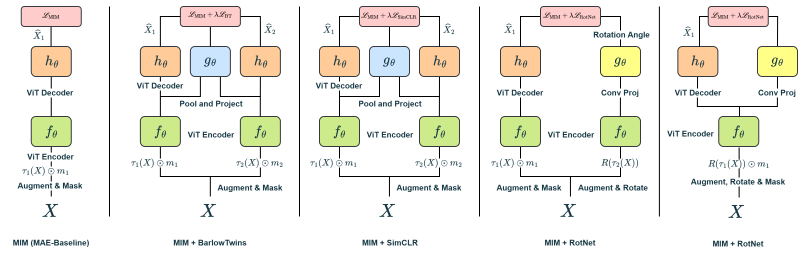
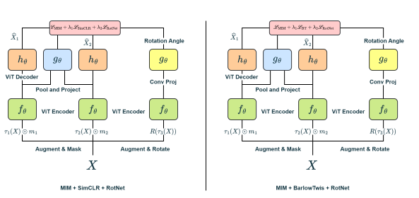

## Masked Autoencoder based Representation Learning

- Trying combination of SSL with MAE
- SSL includes Rotation Net, score matching, barlow twins
- Multi task network combined with MAE

## **Workflows for MAE + MTL SSL Tasks**

- MAE with RotNet, SimCLR, Barlow Twins

- MAE with BT + RotNet and SimCLR + RotNet

